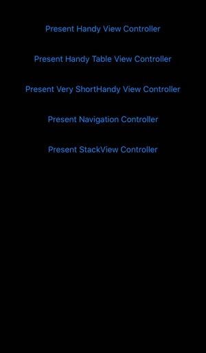
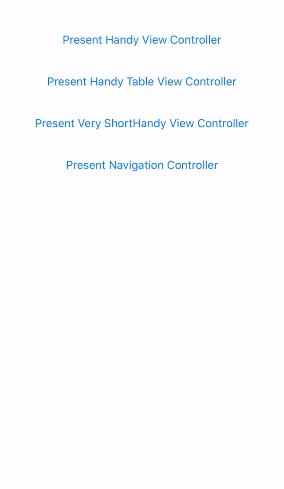
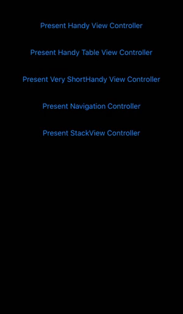

[](https://www.apache.org/licenses/LICENSE-2.0.html)
[](https://swift.org/package-manager/)

View controller transitioning allowing presented view controller to be dismissed by swiping down.

## Examples


## Requirements
* iOS 10.0+
* Xcode 11+
* Swift 5.2+

## Installation
HandyViewController is distributed with [Swift Package Manager](https://swift.org/package-manager/) which is the only official distribution tool by Apple. You can add HandyViewController to your project from Xcode's `File > Swift Packages > Add Package Dependency` menu with its github URL:
```swift
https://github.com/mobven/HandyViewController.git
```

## Usage
Basically, to achieve HandyViewController presentation, you set `transitioningDelegate` of your view controller to `HandyTransitioningDelegate`. There are two options while initializing `HandyTransitioningDelegate`:
### Content size
Presented view controller must have necessary constraints (from top to bottom) to allow HandyViewController to calculate its height.
```swift
let controller = storyboard!.instantiateViewController(withIdentifier: "ViewController")
let transitioningDelegate = HandyTransitioningDelegate(from: self, to: controller)
controller.modalPresentationStyle = .custom
controller.transitioningDelegate = transitioningDelegate
present(controller, animated: true, completion: nil)
```

### Full Screen
View controller displayed full screen with a small padding in the top.
```swift
let controller = storyboard!.instantiateViewController(withIdentifier: "ViewController")
let transitioningDelegate = HandyTransitioningDelegate(from: self, to: controller, contentMode: .fullScreen)
controller.modalPresentationStyle = .custom
controller.transitioningDelegate = transitioningDelegate
present(controller, animated: true, completion: nil)
```

### ScrollView events
If presented view controller contains any `UIScrollView` (eg. `UITableView`, `UICollectionView`) that has no specifed content height, allow HandyViewController to calculate its size by:
```swift
override func viewDidLoad() {
    super.viewDidLoad()
    registerHandyScrollView(tableView)
}
```

HandyViewController provides swipe-to-dismiss feature with scroll events. To achieve this behavior, in your presented view controller: 
```swift
extension DetailsViewController: UIScrollViewDelegate {
    func scrollViewDidScroll(_ scrollView: UIScrollView) {
        handyScrollViewDidScroll(scrollView)
    } 
    func scrollViewWillEndDragging(_ scrollView: UIScrollView, withVelocity velocity: CGPoint,
                                   targetContentOffset: UnsafeMutablePointer<CGPoint>) {
        handyScrollViewWillEndDragging(scrollView, withVelocity: velocity)
    }
}
```

### StackView usage
During usage we've faced content size calculation issues with presented view controllers containing `UIStackView` with `fill` distribution and alignment attributes. As a workaround to this issue `HandyViewController` adds an empty footer view to your stack view, which is invisible. You can achieve this by calling:
```swift
override func viewDidLoad() {
    super.viewDidLoad()
    registerHandyStackView(stackView)
}
```

## What's next
- Allow view controller to interrupt swipe-to-dismiss. 
- Tests in iPads.
- Swipe-to-dismiss indicator in top of the screen.
- iOS 13 modal presentation style for full-screen presented view controllers where presenting view controller frame decreased in background.
- Unit Tests.

---
Developed with 🖤 at [Mobven](https://mobven.com/)
